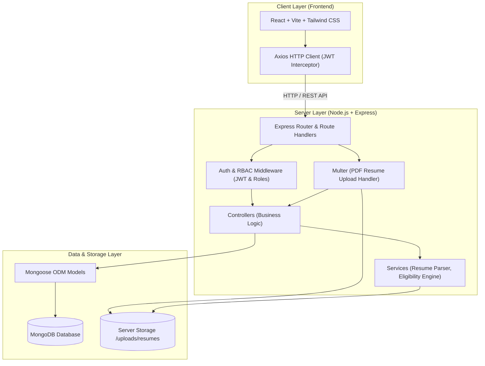
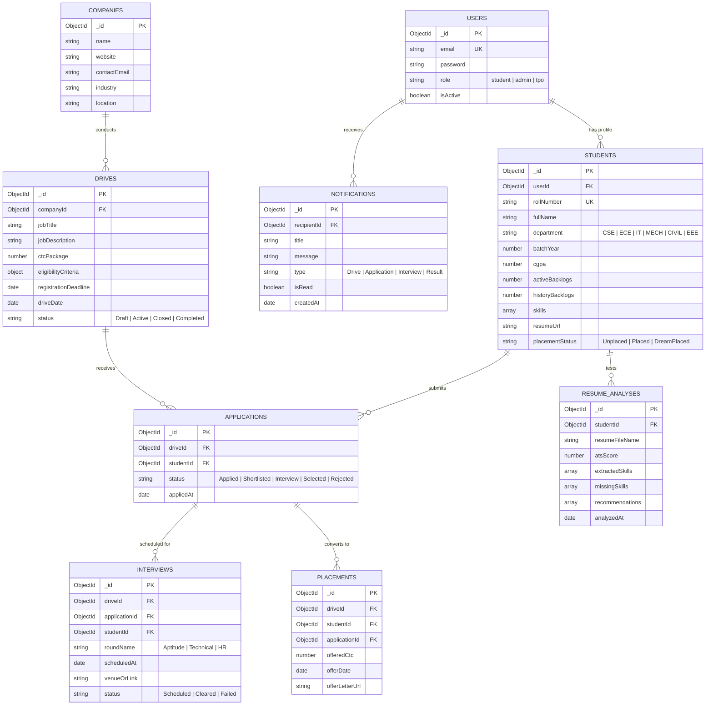
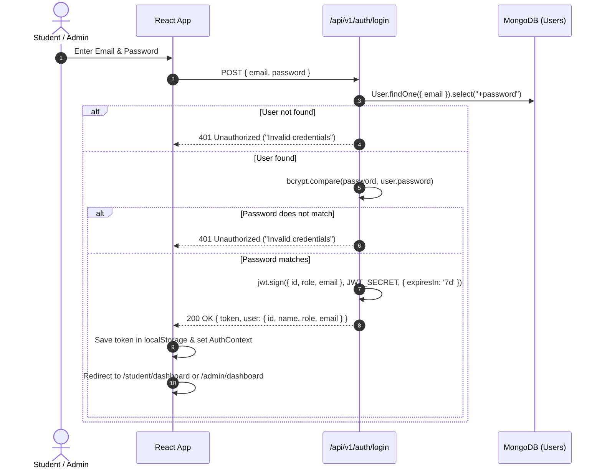
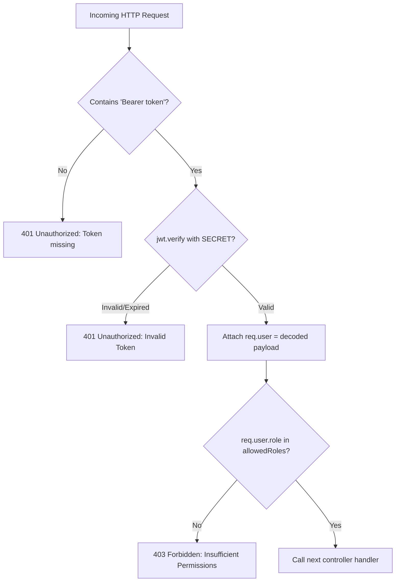
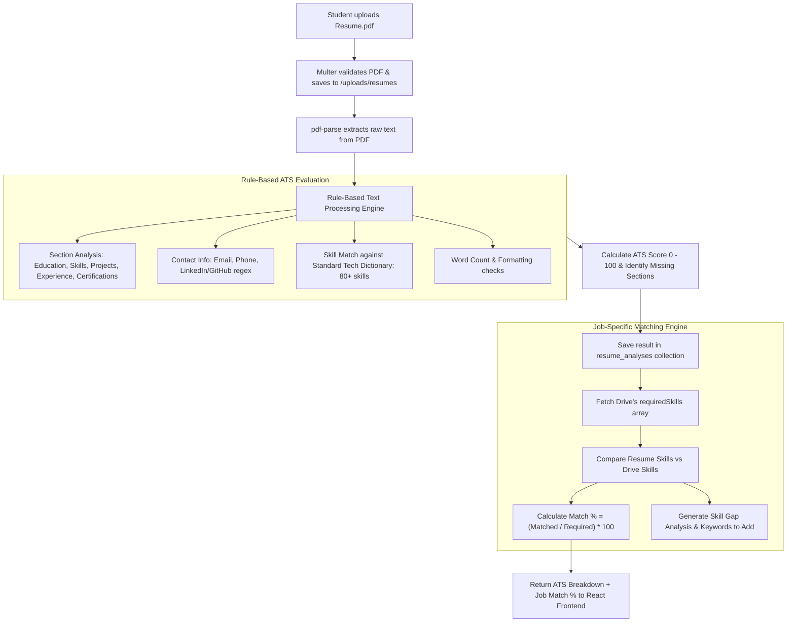
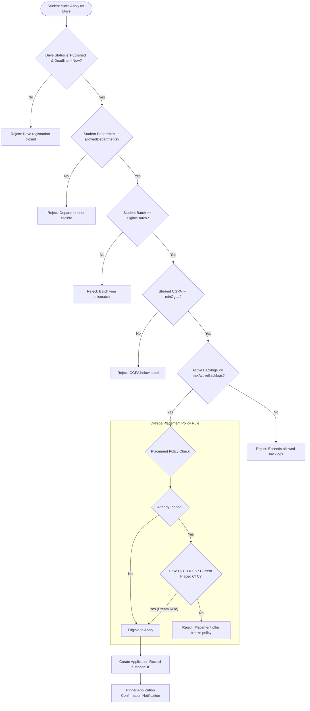
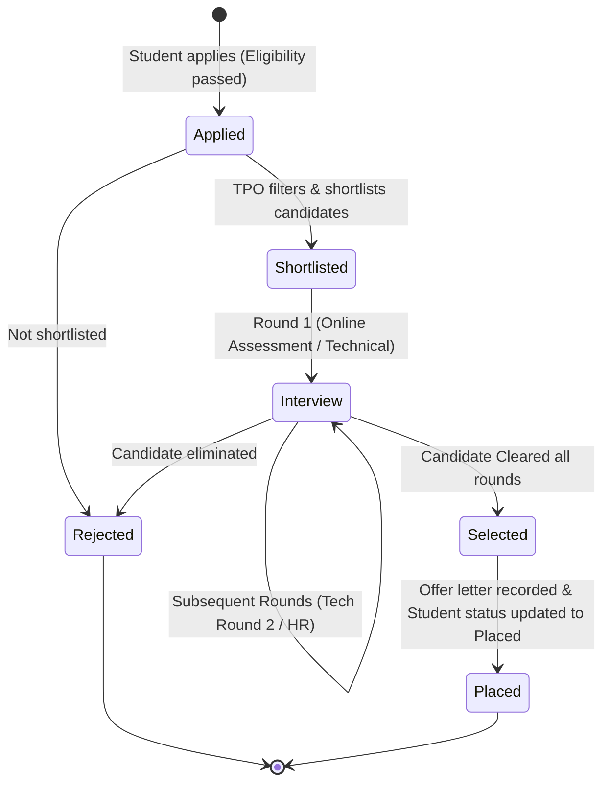
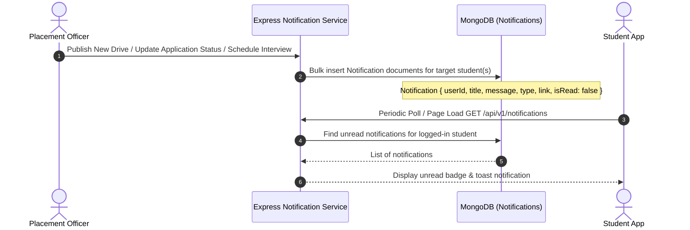
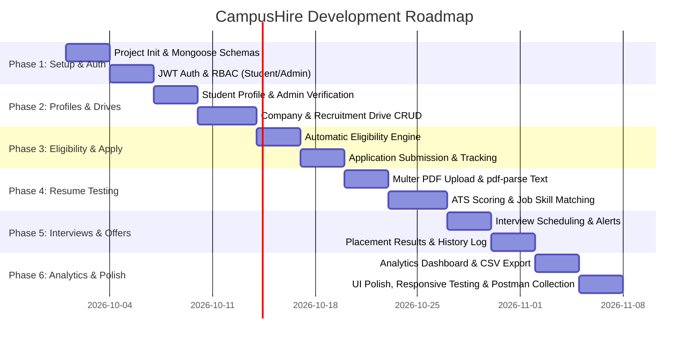

# CampusHire – College Placement & Recruitment Management System
## Complete Implementation Plan & System Architecture Document

**Course:** BTWA (Backend Technologies for Web Applications)  
**Target Architecture:** Client-Server Monolith (React Vite + Node.js/Express + MongoDB)  
**Security & Auth:** JWT + bcrypt, Role-Based Access Control (RBAC)

---

## 1. System Architecture

CampusHire is built on a 3-tier monolithic web architecture designed for clarity, maintainability, and ease of demonstration for college academic evaluation.



### Architectural Principles for BTWA:
- **Clean Separation of Concerns:** Frontend (`/client`) and Backend (`/server`) run independently during development (`localhost:5173` and `localhost:5000`) with CORS configured.
- **Stateless RESTful APIs:** Express handles all business logic, authenticated via Bearer tokens in HTTP headers.
- **Rule-Based In-Engine Processing:** Resume testing and eligibility verification run as pure Node.js services without heavy external microservice dependencies.

---

## 2. Frontend Architecture (React + Vite + Tailwind CSS)

The client application uses standard React 18 with Vite for bundling and Tailwind CSS for responsive styling.

### 2.1 State Management & Routing
- **Routing:** `react-router-dom` (v6+) with public routes, student-protected routes, and admin/TPO-protected routes (`<ProtectedRoute role="...">`).
- **Global State:** React Context API:
  - `AuthContext`: Manages user login state, JWT in `localStorage`, user role, and logout timer.
  - `NotificationContext`: Manages unread notification counts and auto-refresh/polling.
- **HTTP Layer:** Centralized Axios instance (`api.js`) with:
  - Request interceptor: Injects `Authorization: Bearer <token>`.
  - Response interceptor: Catches 401 Unauthorized errors and redirects to `/login`.

### 2.2 Component Hierarchy & Views
```
App
├── Navbar (Dynamic items based on Student vs Admin)
├── Routes
│   ├── Public: /login, /register, /forgot-password
│   ├── Student:
│   │   ├── /student/dashboard (Live updates, stats, upcoming drives)
│   │   ├── /student/profile (Academic info, CGPA, backlogs, skills)
│   │   ├── /student/drives (Drive listing with instant eligibility badge)
│   │   ├── /student/drives/:id (Drive details & 1-click apply)
│   │   ├── /student/applications (Application tracker timeline)
│   │   ├── /student/interviews (Scheduled rounds & venue/meeting links)
│   │   └── /student/resume-analyzer (Upload resume, ATS score, job match)
│   └── Admin/TPO:
│       ├── /admin/dashboard (Total placed, top packages, drive summary)
│       ├── /admin/drives (Create & manage recruitment drives)
│       ├── /admin/drives/:id/applicants (Filter eligible/applied, change stage)
│       ├── /admin/companies (Company profiles & past placement stats)
│       ├── /admin/interviews (Schedule interview rounds)
│       ├── /admin/results (Publish offers & mark placed)
│       ├── /admin/analytics (Placement graphs: branch-wise, package-wise)
│       └── /admin/reports (Export CSV/PDF reports)
└── Footer & Toast Notification Container
```

---

## 3. Backend Architecture (Node.js + Express.js)

The backend follows a layered MVC-Service pattern ensuring clean code for viva and presentation.

```
server/
├── config/             # DB connection, JWT secret, constants
├── controllers/        # Request parsing and HTTP response handling
├── middlewares/        # JWT auth, role validation, file upload, error handling
├── models/             # Mongoose schemas & data validation
├── routes/             # Express API routes
├── services/           # Business logic: eligibilityCheck, resumeParser, pdfExtractor
└── utils/              # Helper functions, API response wrapper, logger
```

### 3.1 Key Backend Middlewares:
1. `authMiddleware.js`: Verifies `req.headers.authorization`, decodes token, attaches `req.user`.
2. `roleMiddleware.js`: Accepts allowed roles (`['admin', 'tpo']` or `['student']`) and blocks unauthorized access with 403 Forbidden.
3. `uploadMiddleware.js`: Configures `multer` for `.pdf` files, limits file size (e.g., 5MB), and validates MIME type.
4. `errorHandler.js`: Centralized error catcher that returns consistent `{ success: false, message, error }` JSON responses.

---

## 4. Database Architecture & MongoDB Collections

CampusHire uses MongoDB with Mongoose ODM. Schemas enforce strict data validation, indexing, and foreign references.



### Detailed Schema Specifications

#### 1. `users`
- `_id`: ObjectId
- `name`: String (Required)
- `email`: String (Unique, Indexed, Lowercase)
- `password`: String (Bcrypt hashed, select: false by default)
- `role`: Enum `['student', 'admin', 'tpo']`
- `createdAt`, `updatedAt`: Timestamps

#### 2. `students`
- `_id`: ObjectId
- `userId`: Ref -> `users._id` (Unique, 1-to-1)
- `rollNumber`: String (Unique, Indexed)
- `fullName`: String
- `department`: Enum `['CSE', 'IT', 'ECE', 'EEE', 'MECH', 'CIVIL']`
- `batchYear`: Number (e.g., 2026)
- `cgpa`: Number (e.g., 8.45)
- `tenthPercentage`: Number
- `twelfthOrDiplomaPercentage`: Number
- `activeBacklogs`: Number (default: 0)
- `historyBacklogs`: Number (default: 0)
- `skills`: [String] (e.g., `["React", "Node.js", "MongoDB", "Python"]`)
- `resumeUrl`: String (Path to uploaded PDF)
- `placementStatus`: Enum `['Unplaced', 'Placed', 'Higher Studies']`
- `currentMaxPackage`: Number (default: 0, used for dream offer eligibility)

#### 3. `companies`
- `_id`: ObjectId
- `name`: String (Unique, Indexed)
- `description`: String
- `website`: String
- `contactPerson`: { name: String, email: String, phone: String }
- `industry`: String (e.g., "IT / Software", "Consulting", "Core Engineering")
- `tier`: Enum `['Normal', 'Dream', 'SuperDream']` (based on CTC)

#### 4. `drives` (Recruitment Drives)
- `_id`: ObjectId
- `companyId`: Ref -> `companies._id`
- `jobTitle`: String (e.g., "Software Engineer Trainee")
- `jobDescription`: String
- `requiredSkills`: [String] (Used for automated resume matching)
- `jobLocation`: String
- `ctcPackage`: Number (in LPA, e.g., 8.5)
- `eligibilityCriteria`:
  - `minCgpa`: Number
  - `maxActiveBacklogs`: Number
  - `allowedDepartments`: [String]
  - `eligibleBatch`: Number
  - `minTenthPercentage`: Number
  - `minTwelfthPercentage`: Number
- `rounds`: [String] (e.g., `["Online Assessment", "Technical Interview", "HR Round"]`)
- `registrationDeadline`: Date
- `driveDate`: Date
- `status`: Enum `['Draft', 'Published', 'Ongoing', 'Completed', 'Cancelled']`
- `createdBy`: Ref -> `users._id`

#### 5. `applications`
- `_id`: ObjectId
- `driveId`: Ref -> `drives._id` (Indexed with studentId for Compound Unique index)
- `studentId`: Ref -> `students._id`
- `resumeUsed`: String (Snapshot URL of resume at application time)
- `matchScore`: Number (Snapshot of job match % at apply time)
- `currentStage`: String (e.g., "Applied", "OA Cleared", "Tech Round", "HR Round", "Selected", "Rejected")
- `status`: Enum `['Applied', 'In-Review', 'Shortlisted', 'Interview', 'Selected', 'Rejected', 'Withdrawn']`
- `appliedAt`: Date (default: Date.now)
- `statusHistory`: `[{ stage: String, updatedBy: Ref to user, timestamp: Date, remarks: String }]`

#### 6. `interviews`
- `_id`: ObjectId
- `driveId`: Ref -> `drives._id`
- `studentId`: Ref -> `students._id`
- `applicationId`: Ref -> `applications._id`
- `roundName`: String
- `scheduledTime`: Date
- `mode`: Enum `['Offline', 'Online']`
- `venueOrLink`: String (e.g., "Seminar Hall 2" or Google Meet URL)
- `instructions`: String
- `status`: Enum `['Scheduled', 'Completed', 'Cancelled', 'Rescheduled']`
- `feedback`: String

#### 7. `placements` (Results / Offers)
- `_id`: ObjectId
- `driveId`: Ref -> `drives._id`
- `studentId`: Ref -> `students._id`
- `companyId`: Ref -> `companies._id`
- `offeredRole`: String
- `packageCtc`: Number (LPA)
- `offerDate`: Date
- `offerLetterUrl`: String
- `acceptanceStatus`: Enum `['Pending', 'Accepted', 'Declined']`

#### 8. `notifications`
- `_id`: ObjectId
- `userId`: Ref -> `users._id` (Recipient)
- `title`: String
- `message`: String
- `type`: Enum `['DriveAlert', 'ApplicationStatus', 'InterviewSchedule', 'ResultAnnouncement', 'General']`
- `link`: String (Target URL within app)
- `isRead`: Boolean (default: false)
- `createdAt`: Date

#### 9. `resume_analyses`
- `_id`: ObjectId
- `studentId`: Ref -> `students._id`
- `fileName`: String
- `rawText`: String
- `detectedSections`: [String] (e.g., "Education", "Projects", "Skills", "Experience")
- `detectedSkills`: [String]
- `atsScore`: Number (0 - 100)
- `feedback`: [String] (e.g., "Add quantifiable metrics in projects", "Missing GitHub link")
- `createdAt`: Date

---

## 5. Relationships Between Collections

```
+---------------------------------------------------------------------------------+
|                                 RELATIONSHIP MAP                                |
+---------------------------------------------------------------------------------+
| User (1)          <---- 1:1 ---->   Student (1)                                |
| Company (1)       <---- 1:N ---->   Drive (N)                                  |
| Drive (1)         <---- 1:N ---->   Application (N)   <---- N:1 ---- Student (1)|
| Drive + Student   <---- 1:1 ---->   Unique Application constraint               |
| Application (1)   <---- 1:N ---->   Interview Rounds (N)                       |
| Application (1)   <---- 1:1 ---->   Placement Offer (1)                        |
| User (1)          <---- 1:N ---->   Notification (N)                           |
| Student (1)       <---- 1:N ---->   Resume Analysis History (N)                |
+---------------------------------------------------------------------------------+
```

### Design Decision: References vs Embedded
- **Referenced Documents (Normalized):** We use Mongoose `ObjectId` references for Drives, Applications, and Students. Placement data is query-heavy across departments and years; referencing enables fast multi-dimensional aggregations (`$lookup`, `$match`, `$group`).
- **Embedded Documents (Denormalized):** `statusHistory` inside `Application` and `eligibilityCriteria` inside `Drive` are embedded because they are always read alongside their parent record and have bounded size.

---

## 6. REST API Structure

All API responses follow a uniform JSON structure:
```json
{
  "success": true,
  "message": "Operation completed successfully",
  "data": { ... }
}
```

### 6.1 Authentication & Profile APIs
| Method | Endpoint | Access | Purpose |
|---|---|---|---|
| `POST` | `/api/v1/auth/register` | Public | Register student with basic details |
| `POST` | `/api/v1/auth/login` | Public | Authenticate user, return JWT & role |
| `GET` | `/api/v1/auth/me` | Logged In | Return current user session |
| `GET` | `/api/v1/student/profile` | Student | Get student academic & personal profile |
| `PUT` | `/api/v1/student/profile` | Student | Update contact info, skills, bio |
| `PUT` | `/api/v1/student/academic-profile`| Admin/TPO | Update verified CGPA, backlogs, department |

### 6.2 Recruitment Drives & Companies APIs
| Method | Endpoint | Access | Purpose |
|---|---|---|---|
| `GET` | `/api/v1/companies` | All Logged In | List hiring partner companies |
| `POST` | `/api/v1/companies` | Admin/TPO | Add new company profile |
| `GET` | `/api/v1/drives` | All Logged In | List all active/upcoming recruitment drives |
| `GET` | `/api/v1/drives/:id` | All Logged In | Get specific drive details & criteria |
| `POST` | `/api/v1/drives` | Admin/TPO | Create new recruitment drive |
| `PUT` | `/api/v1/drives/:id` | Admin/TPO | Update drive details, deadline, or status |
| `DELETE`| `/api/v1/drives/:id` | Admin/TPO | Cancel or delete a drive |
| `GET` | `/api/v1/drives/:id/eligibility` | Student | Pre-check student eligibility for this drive |

### 6.3 Applications & Tracking APIs
| Method | Endpoint | Access | Purpose |
|---|---|---|---|
| `POST` | `/api/v1/applications/apply/:driveId` | Student | Apply for a drive (triggers eligibility check) |
| `GET` | `/api/v1/applications/my` | Student | View all drives student applied to & statuses |
| `GET` | `/api/v1/applications/drive/:driveId` | Admin/TPO | View all applicants for a drive with filters |
| `PATCH`| `/api/v1/applications/:id/status` | Admin/TPO | Update applicant status (Shortlist/Reject/Next) |

### 6.4 Interviews & Results APIs
| Method | Endpoint | Access | Purpose |
|---|---|---|---|
| `POST` | `/api/v1/interviews/schedule` | Admin/TPO | Schedule an interview round for candidates |
| `GET` | `/api/v1/interviews/my` | Student | View upcoming interview schedule & links |
| `GET` | `/api/v1/interviews/drive/:driveId` | Admin/TPO | View scheduled interviews for a drive |
| `POST` | `/api/v1/placements/publish` | Admin/TPO | Select candidate, log offer package & role |
| `GET` | `/api/v1/placements/history` | All Logged In | Public/student placement records & statistics |
| `GET` | `/api/v1/placements/my-offer` | Student | View student's offer details |

### 6.5 Resume Testing & Job Matching APIs
| Method | Endpoint | Access | Purpose |
|---|---|---|---|
| `POST` | `/api/v1/resumes/upload` | Student | Upload resume PDF, store on server |
| `POST` | `/api/v1/resumes/analyze` | Student | Run rule-based ATS analysis on uploaded resume |
| `POST` | `/api/v1/resumes/match-job/:driveId` | Student | Match student's resume against drive skills |

### 6.6 Notifications, Dashboard & Analytics APIs
| Method | Endpoint | Access | Purpose |
|---|---|---|---|
| `GET` | `/api/v1/notifications` | Logged In | Fetch user notifications (with unread count) |
| `PATCH`| `/api/v1/notifications/:id/read` | Logged In | Mark notification as read |
| `GET` | `/api/v1/admin/analytics/overview` | Admin/TPO | Placed vs unplaced ratio, branch-wise, CTC stats |
| `GET` | `/api/v1/admin/reports/export` | Admin/TPO | Export eligible or placed students to CSV |

---

## 7. Authentication Flow (JWT + bcrypt)



---

## 8. Authorization Flow (Role-Based Access Control)

Every protected backend request passes through a two-step validation:



### Implementation Logic:
- `verifyToken`: Validates JWT from `req.headers.authorization`.
- `authorizeRoles('admin', 'tpo')`: Prevents students from creating drives, modifying results, or changing application stages.
- `authorizeRoles('student')`: Ensures student-specific operations (e.g., applying, testing resume) are only performed by students.

---

## 9. Resume Testing & Job-Specific Resume Matching Flow

A clean, reliable, rule-based ATS analysis system implemented using `multer` and `pdf-parse`:



### ATS Scoring Weights (Total: 100 pts):
1. **Essential Sections Found (30 pts):** Education (6), Skills (8), Projects (8), Experience/Internships (4), Contact/Links (4).
2. **Contact & Social Verification (15 pts):** Valid Email (5), Phone Number (5), GitHub or LinkedIn URL (5).
3. **Skill Density & Variety (25 pts):** Matching across programming languages, web frameworks, databases, and core CS concepts.
4. **Project Descriptions & Action Verbs (20 pts):** Detection of action verbs (*developed, implemented, designed, optimized, deployed*).
5. **Length & Formatting (10 pts):** Optimal word count (between 250 and 800 words for college students).

---

## 10. Automatic Eligibility Checking Flow

Before a student can click **"Apply Now"** or before the backend accepts an application, the Eligibility Engine executes 6 validation gates:



---

## 11. Application Tracking Flow

Tracks candidates through recruitment stages with status histories and transparency:



---

## 12. Notification Flow

CampusHire keeps students and administrators informed through triggered event notifications:



### Event Triggers:
1. **New Drive Published:** Notifies all eligible students of that batch/department.
2. **Application Status Changed:** "You have been shortlisted for [Company] Round 1".
3. **Interview Scheduled:** Includes date, time, venue, or meeting link.
4. **Offer Announced:** "Congratulations! You have received an offer from [Company]".

---

## 13. Recommended Folder Structure

A clean, production-standard monorepo structure with clear boundaries:

```
CampusHire/
├── client/                             # Frontend React + Vite
│   ├── public/                         # Static assets & favicon
│   ├── src/
│   │   ├── assets/                     # Images, icons, banners
│   │   ├── components/                 # Reusable UI components
│   │   │   ├── common/                 # Button, Input, Modal, Table, Badge, Card
│   │   │   ├── layout/                 # Navbar, Sidebar, Footer, ProtectedRoute
│   │   │   ├── student/                # EligibilityBadge, ResumeUploadCard, ScoreGauge
│   │   │   └── admin/                  # ApplicantTable, DriveForm, StatusChangeModal
│   │   ├── context/                    # AuthContext, NotificationContext
│   │   ├── pages/                      # Top-level route pages
│   │   │   ├── auth/                   # Login.jsx, Register.jsx
│   │   │   ├── student/                # Dashboard, Drives, Applications, ResumeAnalyzer, Profile
│   │   │   └── admin/                  # Dashboard, DrivesManage, Applicants, Interviews, Analytics
│   │   ├── services/                   # Axios API service callers (api.js, authService.js, etc.)
│   │   ├── utils/                      # Formatters (currency, date), constants
│   │   ├── App.jsx                     # Route definitions
│   │   ├── main.jsx                    # Root mount with contexts
│   │   └── index.css                   # Tailwind directives & theme styles
│   ├── index.html
│   ├── package.json
│   ├── tailwind.config.js
│   └── vite.config.js
│
├── server/                             # Backend Node.js + Express
│   ├── config/
│   │   ├── db.js                       # Mongoose connection
│   │   └── constants.js                # Roles, status enums, tech skill vocabulary
│   ├── controllers/
│   │   ├── authController.js           # Login, register, get current user
│   │   ├── studentController.js        # Profile management
│   │   ├── driveController.js          # Drive CRUD, eligibility check
│   │   ├── applicationController.js    # Apply, list, status updates
│   │   ├── interviewController.js      # Interview scheduling & updates
│   │   ├── placementController.js      # Offer publication, placement history
│   │   ├── resumeController.js         # Upload, ATS analysis, job match
│   │   ├── notificationController.js   # Fetch & mark read
│   │   └── analyticsController.js      # Placement stats, graphs data, CSV export
│   ├── middlewares/
│   │   ├── authMiddleware.js           # JWT verification
│   │   ├── roleMiddleware.js           # RBAC permission check
│   │   ├── uploadMiddleware.js         # Multer configuration for PDFs
│   │   └── errorHandler.js             # Global error handler
│   ├── models/
│   │   ├── User.js
│   │   ├── Student.js
│   │   ├── Company.js
│   │   ├── Drive.js
│   │   ├── Application.js
│   │   ├── Interview.js
│   │   ├── Placement.js
│   │   ├── Notification.js
│   │   └── ResumeAnalysis.js
│   ├── routes/
│   │   ├── authRoutes.js
│   │   ├── studentRoutes.js
│   │   ├── driveRoutes.js
│   │   ├── applicationRoutes.js
│   │   ├── interviewRoutes.js
│   │   ├── placementRoutes.js
│   │   ├── resumeRoutes.js
│   │   ├── notificationRoutes.js
│   │   └── analyticsRoutes.js
│   ├── services/
│   │   ├── eligibilityService.js       # Core eligibility verification logic
│   │   ├── resumeParserService.js      # pdf-parse text extraction & regex
│   │   └── atsScorerService.js         # ATS scoring & keyword comparison
│   ├── uploads/
│   │   └── resumes/                    # Stored student PDF resumes (.gitignore tracked)
│   ├── .env.example                    # Environment variable template
│   ├── package.json
│   └── server.js                       # Express app entry point
│
└── README.md                           # Setup and presentation guide
```

---

## 14. Development Phases & Milestones

Structured in 6 manageable phases designed to match BTWA sprint deliverables:



### Detailed Phase Deliverables

#### Phase 1: Foundation & Authentication
- Initialize Express server, configure MongoDB Atlas/local connection with Mongoose.
- Setup `User` schema with bcrypt hashing pre-save hooks.
- Build Register & Login endpoints returning signed JWTs with roles (`student`, `tpo`, `admin`).
- Implement `authMiddleware` and `roleMiddleware`.
- **Postman Testing:** Verify token generation, invalid password rejection, and protected route access.

#### Phase 2: Student Profiles & Recruitment Drive Management
- Create `Student` and `Company` schemas.
- Build Student Profile CRUD (Academic details: CGPA, backlogs, department, batch).
- Build Admin Recruitment Drive Management (Create drive with package, criteria, and deadlines).
- **Frontend:** Build Login/Register screens, Navigation, and Student/Admin Dashboards.

#### Phase 3: Automatic Eligibility Checking & Applications
- Implement `eligibilityService.js` evaluating CGPA, backlogs, branch, and dream offer criteria.
- Build `GET /api/v1/drives/:id/eligibility` returning `{ isEligible: true/false, reasons: [] }`.
- Build `POST /api/v1/applications/apply/:driveId` preventing ineligible or duplicate submissions.
- Implement Application Status Pipeline (Applied $\rightarrow$ Shortlisted $\rightarrow$ Rejected).

#### Phase 4: Resume Upload & Rule-Based ATS Analysis
- Setup `multer` for secure PDF resume uploads to `/uploads/resumes`.
- Integrate `pdf-parse` for text extraction.
- Implement rule-based ATS analysis:
  - Detect required sections (Education, Skills, Experience, Projects).
  - Extract skills from a predefined dictionary of 80+ software and core skills.
  - Compute 0–100 ATS Score with improvement recommendations.
- Implement Job Matching: Compare extracted resume skills with `Drive.requiredSkills` and output match percentage + missing keywords.

#### Phase 5: Interview Scheduling, Results & Notifications
- Implement `interviews` collection with round names, venues/links, and dates.
- Build notification creation triggers on drive creation, status changes, and interview scheduling.
- Implement `placements` collection to publish final selections, update student's status to `Placed`, and log package.

#### Phase 6: Analytics, Reporting & UI Polish
- MongoDB aggregation pipeline for placement statistics:
  - Branch-wise placement percentage (`$group` by department).
  - Average, median, and highest CTC package.
  - Top recruiting companies.
- CSV export endpoint for TPO reports (e.g., eligible student list for a company).
- Finalize React Tailwind UI with clean badges, responsive tables, loading skeletons, and toast messages.
- Prepare complete Postman Collection with environment variables for project presentation.
