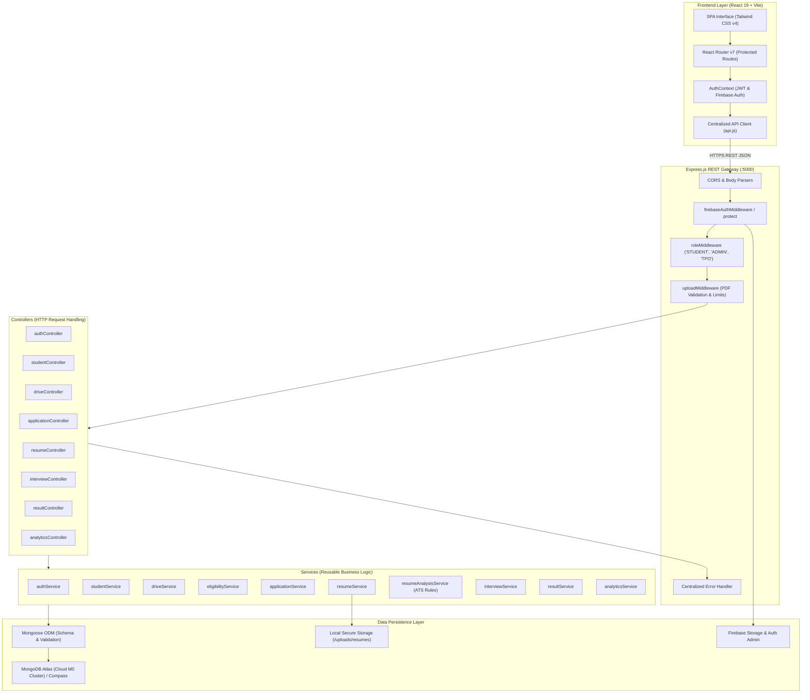
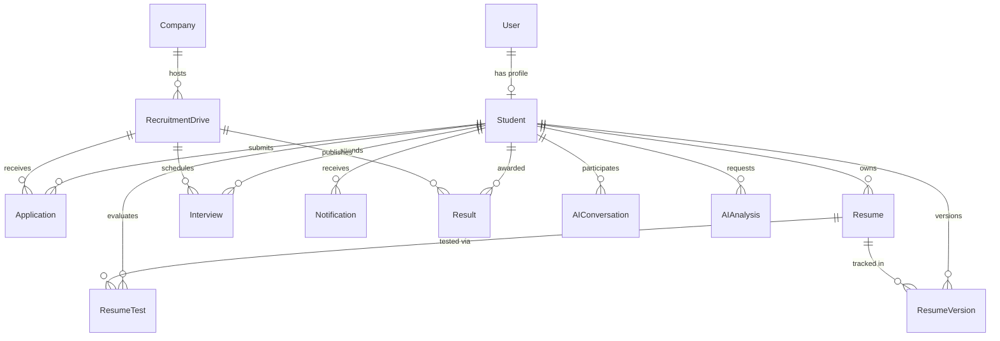

# CampusHire – Project Architecture & Technical Design

> **Document Version:** 1.0.0  
> **Course:** BTWA (Backend Technologies for Web Applications) Capstone Project  
> **Target Audience:** Academic Evaluators, External Examiners, & Developers

---

## 1. Architectural Philosophy & Principles

CampusHire adheres to the **Layered Architecture (MVC-Service Pattern)**. It enforces strict separation of concerns, ensuring high maintainability, testability, and academic clarity:

- **Zero TypeScript Policy:** Written in clean, modern vanilla JavaScript (`ES6+`) to adhere to BTWA college constraints.
- **Stateless RESTful APIs:** Express endpoints communicate via standardized JSON payloads and semantic HTTP status codes.
- **Dual Authentication Layer:** Leverages Firebase Authentication (ID Tokens) for cloud-native security, with seamless fallback to localized JWTs for automated evaluation and offline viva presentations.
- **Data Isolation & Confidentiality:** Multi-tenant student privacy boundaries prevent unauthorized cross-student data exposure (IDOR protection).

---

## 2. High-Level System Architecture Diagram

---

## 3. Layer Separation of Concerns

### A. Presentation Layer (`client/`)
- **React 19 & Vite:** Single Page Application (SPA) with lightning-fast Hot Module Replacement (HMR).
- **Tailwind CSS v4:** Utility-first styling delivering modern typography, high contrast, responsive grid layouts, and zero external CSS runtime overhead.
- **Context API (`AuthContext`):** Manages user session state, authentication persistence, and reactive logout across tabs.
- **Centralized API Client (`api.js`):** Intercepts requests to inject `Authorization: Bearer <token>` headers and centralizes 401 session expiry redirects.

### B. Gateway & Middleware Layer (`server/middlewares/`)
- `firebaseAuthMiddleware`: Verifies Firebase ID Tokens cryptographically via the Firebase Admin SDK and maps the Firebase UID to the internal MongoDB `User` document.
- `roleMiddleware`: Enforces Role-Based Access Control (`'student'`, `'admin'`, `'tpo'`), denying unauthorized role traversal with HTTP `403 Forbidden`.
- `uploadMiddleware`: Restricts resume uploads strictly to valid PDF files under 5MB using `multer` with sanitized file naming (`resume_<userId>_<timestamp>_<name>.pdf`).
- `errorHandler`: Global interceptor returning standardized JSON errors (`{ success: false, message: ... }`), preventing stack trace leaks.

### C. Controller Layer (`server/controllers/`)
- Extracts parameters (`req.params`, `req.query`, `req.body`, `req.user`).
- Validates payload presence and format before delegating to the service layer.
- Formats responses utilizing standardized helpers (`successResponse`, `errorResponse`).

### D. Service Layer (`server/services/`)
- Contains pure, reusable business logic decoupled from HTTP transport.
- Examples:
  - `eligibilityService`: Pure functional rule evaluation against academic thresholds.
  - `resumeAnalysisService`: Regular-expression-based keyword density evaluation, section completeness scoring, and word count calculation.
  - `analyticsService`: High-performance MongoDB aggregation pipelines for branch and company placement statistics.

### E. Data Persistence Layer (`server/models/`)
- 14 Mongoose models with validation rules, compound indexes, and explicit foreign key relationships (`ref`).

---

## 4. Entity-Relationship (ER) Architecture

---

## 5. Security Architecture & RBAC Matrix

| Resource / Endpoint | Student | Admin / TPO | Unauthenticated |
| :--- | :---: | :---: | :---: |
| `/api/auth/register` & `/login` | Public | Public | Public |
| `/api/students/profile` (Own) | Read / Write | Read Only | ❌ Denied (401) |
| `/api/admin/students` (All) | ❌ Denied (403) | Read / Filter | ❌ Denied (401) |
| `/api/companies` (Browse) | Read Only | Full CRUD | ❌ Denied (401) |
| `/api/drives` (Browse Active) | Read Only | Full CRUD | Public / Auth |
| `/api/drives/:id/eligibility` | Read Own | Full View | ❌ Denied (401) |
| `/api/applications/my` | Read Own | N/A | ❌ Denied (401) |
| `/api/admin/applications` | ❌ Denied (403) | Read / Update Stage | ❌ Denied (401) |
| `/api/resumes/upload` & `/my` | Full (Own) | ❌ Denied (403) | ❌ Denied (401) |
| Peer Student Resumes | ❌ Denied (403) | Authorized View | ❌ Denied (401) |
| `/api/interviews/my` | Read Own | N/A | ❌ Denied (401) |
| `/api/admin/interviews` | ❌ Denied (403) | Schedule & Feedback | ❌ Denied (401) |
| `/api/results/my` | Read Own | N/A | ❌ Denied (401) |
| `/api/results` (Publish) | ❌ Denied (403) | Publish / Manage | ❌ Denied (401) |
| `/api/admin/analytics/*` | ❌ Denied (403) | View Executive KPIs | ❌ Denied (401) |

---

## 6. Performance & Scalability Considerations

1. **Strategic MongoDB Indexing:**
   - Single & compound indexes on `rollNumber`, `email`, `firebaseUid`, `student`, `recruitmentDrive`, `status`, and `createdAt` ensure sub-millisecond query execution.
2. **Selective Query Projections:**
   - Excludes heavy fields (e.g. `password` hash via `select: false`, `extractedText` on list queries) to minimize network payload sizes.
3. **Optimized Build Assets:**
   - Client code minified via Vite into gzipped CSS (~10KB) and chunked JavaScript.
4. **Resilient Offline Architecture:**
   - Fallback authentication routes and pre-seeded database scripts ensure the entire platform can be presented seamlessly without active internet connections if required.
